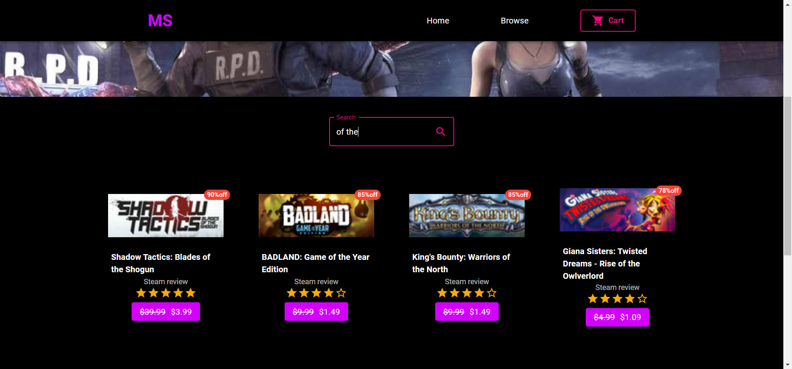

# React App Challenge

Single-page application that list items, has a text input to filter them by name and allows item selection along with a total price calculator.

## Images





## Technologies used

- React
- create-react-app
- Material UI

## Build instructions

### Setting up the development environment

Requirements:

1. [Node.js](https://nodejs.org/en/download/)
2. NPM

The first step is to install the dependencies.

In the `./react-challenge/client` directory, run the following command:

```bash
# this might take a while to complete
npm install
```

Once the installation is finished, you can run it locally with:

```bash
npm start
```

### Running it with Docker

The `client` directory has a Dockerfile to run the containerized application in a staging environment. Build the images and start the containers with Docker Engine or Docker Desktop.

```bash
docker build -t react-challenge .
docker run -p 80:3000 react-challenge
```
